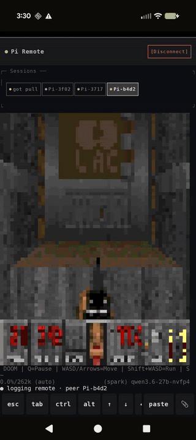

<h1 align="center">Pocket Pi for Android</h1>

<p align="center"><b>Drive your <a href="https://github.com/earendil-works/pi">pi</a> coding agent from your phone.</b><br>
The full terminal, live — no cloud, no accounts, no telemetry.</p>

<p align="center">
  <a href="LICENSE"></a>
  
  <a href="../../releases"></a>
</p>

<p align="center">
  
</p>

The companion app for the
[`pocket-pi`](https://github.com/kolt-mcb/pocket-pi) pi
extension: your live pi terminal on your phone, with a keyboard to drive it.
Your phone talks directly to your machine — nothing in between
([full-res demo video](docs/screenshots/mirror-demo.mp4)).

## Features

- **Your real terminal, live** — pi's actual screen, resized to fit yours:
  messages, menus, pickers, spinners, colors. Stays smooth even on slow
  connections.
- **Terminal keyboard** — Esc/Tab/arrows, Ctrl chords, and multiline input
  on top of your normal keyboard, autocorrect intact. Typing `/` opens pi's
  own command menu.
- **Multi-session** — every pi on your machine appears as a tab. Switch
  between them, start new ones in a folder you pick, or resume a saved one.
- **Inline images** — images the agent shows render right in the mirror,
  even when your terminal can't display them.
- **File delivery** — the agent can send files straight to your phone; they
  arrive in a download dialog.
- **Theme mirroring** — the app restyles itself to pi's active palette.
- **Tablet layout** — side-by-side sessions and a folder picker on large
  screens.
- **Background alerts** — a "pi is ready" notification when a turn finishes
  while the app is backgrounded, and an in-app updater that tracks the
  latest release.

## Yes, it runs DOOM

<p align="center">
  
</p>

The mirror is a real terminal — anything pi renders, the phone renders.
Here that's [pi-doom](https://github.com/badlogic/pi-doom) in a session
tab, played from the terminal keyboard
([full clip](docs/screenshots/doom-demo.mp4)).

## Getting started

1. **On the machine running pi:**
   `pi install git:github.com/kolt-mcb/pocket-pi`
2. **Start `pi`.** The extension prints a `wss://` URL and a pairing QR code
   (`/remote-qr` re-shows it anytime).
3. **Install the app** — side-load the APK from
   [Releases](../../releases) — and scan the QR from the connect screen.

Scan the QR rather than typing the URL: it carries the auth token **and the
TLS certificate fingerprint** the app pins for the connection. The app asks
for camera permission (QR scanner) and notification permission (connection
indicator and turn-finished alerts).

## Releases

CI publishes a versioned, release-signed APK on every push to `master`; the
rolling **`latest`** pre-release always points at the most recent build. The
in-app updater checks it and offers newer builds automatically.

## Build from source

```bash
git clone https://github.com/kolt-mcb/pocket-pi-app
cd pi-remote-control-app
./gradlew :app:assembleDebug   # or :app:assembleRelease
```

Output lands in `app/build/outputs/apk/{debug,release}/`. A release build
without signing env vars produces an unsigned APK — fine for local use.

`versionCode` = git commit count + 100, `versionName` = short commit SHA
(see `app/build.gradle.kts`). The `+100` offset must stay in sync between
`VERSION_CODE_OFFSET` there and the matching `+ 100` in
`.github/workflows/build-apk.yml`.

<details>
<summary><b>CI signing (maintainers)</b></summary>

The publish job needs four repository secrets: `RELEASE_KEYSTORE_BASE64`
(base64 of a `.keystore`/`.jks`), `RELEASE_KEYSTORE_PASSWORD`,
`RELEASE_KEY_ALIAS`, and `RELEASE_KEY_PASSWORD`. The keystore must be stable
across builds — Android only installs an update over a build signed with the
same key. PR builds run an unsigned `assembleDebug` smoke check and publish
nothing.

</details>

## Protocol

The wire protocol — WebSocket messages, mirror frames, and the escape
sequences the renderer understands — is documented in
[docs/PROTOCOL.md](docs/PROTOCOL.md) and in the
[extension repo](https://github.com/kolt-mcb/pocket-pi#protocol).

## License

[MIT](LICENSE)
